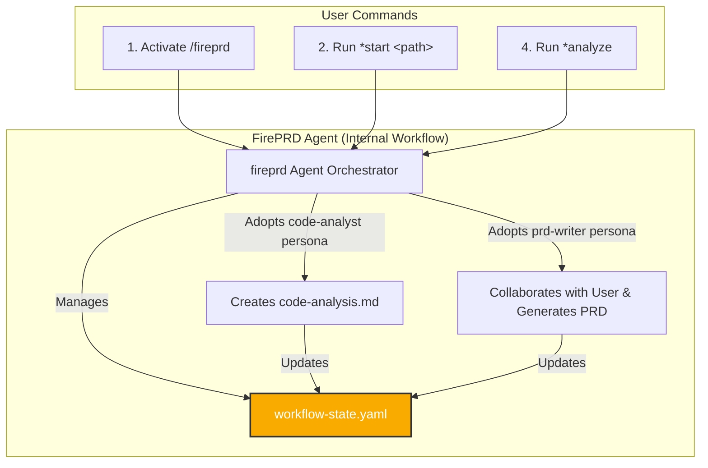

# FirePRD V1 - Architecture Document

This document defines the technical architecture for the FirePRD agentic framework.

## 1. Core Architecture & Principles

### Guiding Principles
* **Pure Prompt Framework:** The system is a library of natural language prompts.
* **Stateful & Resumable:** The workflow is managed via a persistent state file (`workflow-state.yaml`).
* **User-Directed:** An orchestrator agent guides the user, who initiates every major step.
* **Specialized Agents:** A primary orchestrator adopts specialist personas for specific tasks.

### High-Level System Design: The Orchestrated Pipeline

The system uses an Orchestrator-led, three-agent model that separates technical analysis from user-centric writing.

## 2. Component Specifications: Agents, Tasks, & State

### 2.1 The State File (`workflow-state.yaml`)

  * **Responsibility:** To persist the state of the PRD generation process.
  * **Format:** YAML
  * **Location:** `fireprd/cache/workflow-state.yaml`
  * **Schema:** Defines `status`, `sourcePath`, `nextStep`, `artifacts`, and `plan`.

### 2.2 The Agents (Personas)

  * **`fireprd` (The Orchestrator):** The primary user interface and state machine.
  * **`code-analyst` (Specialist Persona):** A non-interactive persona for analyzing source code.
  * **`prd-writer` (Specialist Persona):** An interactive persona for collaborating with the user.

### 2.3 The Tasks (Processes)

  * **`initialize-workflow`:** Creates the initial state file.
  * **`analyze-codebase`:** Performs automated code analysis.
  * **`design-toc`:** Runs the interactive session to design the TOC.
  * **`plan-content`, `finalize-plan`:** Tasks to refine the plan before generation.
  * **`generate-content`:** Generates the final markdown files.

## 3. User Journey & Interaction Model

1.  **Initialization:** User runs `*start <path>` to create the state file.
2.  **Code Analysis:** User runs `*analyze`. Agent asks for approval, switches persona, and performs automated analysis.
3.  **Interactive TOC Design:** User runs `*design-toc`. Agent asks for approval, switches persona, and enters a collaborative loop to refine the TOC.
4.  **Content Planning & Finalization:** User proceeds step-by-step with `*plan-content` and `*finalize-plan`.
5.  **Content Generation:** User runs `*generate-all-chapters` or `*generate-chapter <id>` for parallel execution.

## 4. Error Handling & Recovery

  * **User Input Error:** Agent provides clear error messages and suggests the correct command.
  * **State File Error:** Agent detects missing or corrupt state file and suggests a `*reset`.
  * **Task Execution Error:** Agent performs an internal retry and, if it fails again, reports transparently to the user and asks to try again.
  * **`*reset` Command:** A safe command for the user to delete the cache and start a fresh workflow after confirmation.

## 5. Deployment & Distribution

  * **Distribution Method:** A Git Repository containing the `fireprd/` prompt library.
  * **Installation:** The user copies the `fireprd/` directory into their project root.
  * **Versioning:** The framework follows Semantic Versioning via Git tags.
