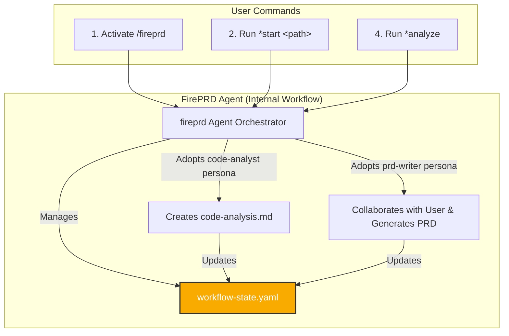

# FirePRD V1 - Architecture Document

This document defines the technical architecture for the FirePRD agentic framework.

## 1. Core Architecture & Principles

### Guiding Principles
* **Pure Prompt Framework:** The system is a library of natural language prompts.
* **Stateful & Resumable:** The workflow is managed via a persistent state file (`workflow-state.yaml`).
* **User-Directed:** An orchestrator agent guides the user, who initiates every major step.
* **Specialized Agents:** A primary orchestrator adopts specialist personas for specific tasks.

### High-Level System Design: The Orchestrated Pipeline
The system uses an Orchestrator-led, three-agent model that separates technical analysis from user-centric writing.

