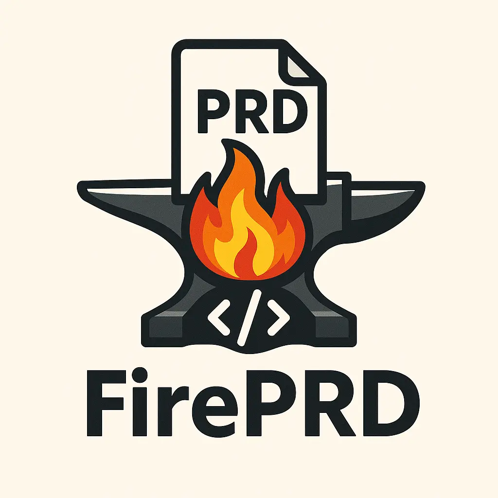

# 🔥 FirePRD: Turn Your Code into a PRD, Instantly.

**FirePRD is an agent-driven framework that analyzes your codebase and collaborates with you to generate a human-centered Product Requirements Document (PRD).**

---

## The Problem: Documentation is Painful

Your codebase is the ultimate source of truth, but it's unreadable to non-technical stakeholders like Product Managers, designers, and executives. Writing and maintaining a PRD that accurately reflects your application is a tedious, manual process that often gets neglected, leading to stale documents and misaligned teams.

## The Solution: An AI Product Team in Your IDE

FirePRD acts like a dedicated product team that lives in your IDE. It's a pure prompt-based framework that uses specialized AI agents to automate the documentation process:

1.  **A Code Analyst** reads your code to understand its features, user journeys, and data models.
2.  **A Product Writer** collaborates with you to design the document and tell the product's story.
3.  **An Orchestrator** manages the entire stateful, resumable workflow, ensuring you are always in control.

The result is a comprehensive, non-technical PRD, generated with a fraction of the manual effort.

---

## Why FirePRD? (Value Propositions)

* **⚡️ Speed up Onboarding:** Generate a clear, readable PRD to help new engineers and stakeholders understand your project in minutes, not weeks.
* **✅ Ensure Accuracy:** The PRD is generated directly from the source code, eliminating the risk of human error and outdated information.
* **🤝 Improve Alignment:** Create a shared "source of truth" that both technical and non-technical team members can understand and rally behind.
* **🧘 Stay in the Flow:** The entire process happens inside your IDE. No context switching, no cumbersome documentation tools. You stay focused on your code.

---

## Features (V1)

- **Agent-Driven Analysis:** A specialist `code-analyst` agent reads your codebase to understand its features, user journeys, and data models.
- **Interactive & Collaborative:** A `prd-writer` agent works with you conversationally to design the Table of Contents and structure of your document.
- **Stateful & Resumable:** The entire workflow is managed via a state file (`workflow-state.toml`), so you can stop and resume the process at any time.
- **User-Directed Workflow:** You are in control. The agent proposes a plan, but you execute each step with explicit commands.
- **Pure Prompt Framework:** FirePRD is a library of prompts designed to be run in any modern AI-powered IDE (like Claude Code, Cursor, etc.). It contains no compiled code.

---

## How It Works: The 5-Step Mental Model

FirePRD guides you through a simple, command-driven workflow. You are always in control.

1.  **`*start`**: You point FirePRD at your codebase to initialize a new session. Activate the `/fireprd` agent and run `*start <path_to_code>` to begin.
2.  **`*analyze`**: The agent autonomously analyzes the code and creates a technical summary artifact.
3.  **`*design-toc`**: You and the agent collaborate to design the structure (Table of Contents) of your PRD.
4.  **`*finalize-plan`**: You give the final approval on the complete plan after running `*plan-content`.
5.  **`*generate-all-chapters`**: The agent writes the final PRD files to your project directory.

---

## Installation

1.  Clone or download this repository.
2.  Copy the entire `fireprd/` directory into the root of the project you wish to document.
3.  **(Recommended)** Add `fireprd/cache/` to your project's `.gitignore` file.
4.  Configure your IDE's AI chat to recognize the `/fireprd` command by pointing it to the `fireprd/agents/fireprd.md` file.

> Note on paths and packaging
>
> This repository shows folders like `agents/`, `tasks/`, and `cache/` at the top-level for development convenience. When you use FirePRD in another project, these should live under a single `fireprd/` directory in that project:
>
> - fireprd/
>   - agents/
>   - tasks/
>   - cache/ (runtime; keep with an empty `.gitkeep`, do not commit generated state)
>   - templates/ (e.g., `workflow-state.example.toml`)
>
> During distribution, ensure packaging places these folders under `fireprd/`. The runtime state file `fireprd/cache/workflow-state.toml` is generated by the `*start` command and should not be checked into source control.

## Usage

In your IDE's AI chat panel:
1.  Type `/fireprd` to activate the agent.
2.  Follow the agent's guidance, starting with `*start .` to analyze the current directory.
3.  Work through each step (`*analyze`, `*design-toc`, `*plan-content`, `*finalize-plan`, `*generate-all-chapters`) to create your PRD.
4.  Use `*status` at any time to see the current `status`, `nextStep`, and artifact locations from `fireprd/cache/workflow-state.toml`.
5.  If you need to tune chapter splitting, run `*set split-threshold <n>` (default is 5) before `*finalize-plan`.
6.  To start fresh, run `*reset` (soft reset clears cache only). For a full cleanup, run `*reset --hard` to also delete generated outputs. Both require confirmation.

---

**Ready to start?** Type `/fireprd` in your IDE's AI chat and follow the interactive workflow!

## Authors

- Huan Li ([@huan](https://github.com/huan))
- Gemini & ChatGPT & Copilot - Shipfail Team ([@shipfail](https://github.com/shipfail))

## License

This project is licensed under the MIT License. See the [LICENSE](LICENSE) file for details